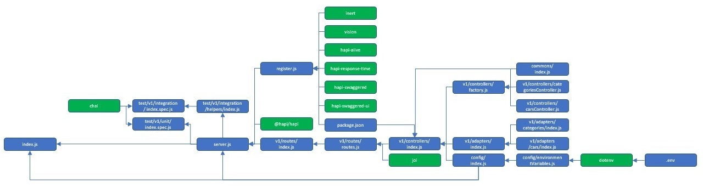
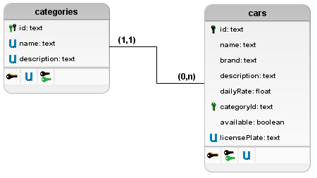

# Sobre

## Objetivo do Projeto
Construção de uma API REST para locadora de carros

## Tecnologias Utilizadas
> Enumeração das tecnologias utilizadas
1. [Node.js](https://nodejs.org/)
2. [Hapi.js](https://hapijs.com/)
3. [Heroku](https://heroku.com/)
4. [Swagger](https://swagger.io/)
5. [PostgreSQL](https://postgresql.org)
6. [ESLint](https://eslint.org)
7. [Mocha](https://mochajs.org)
8. [Chai](https://chaijs.com)
9. [Joi](https://joi.dev/)
10. [Dotenv](https://npmjs.com/package/dotenv)
11. [Nodemon](https://nodemon.io/)
12. [Husky](https://typicode.github.io/husky)
13. [Uuid](https://npmjs.com/package/uuid)
14. [Istanbul](https://istanbul.js.org/)
15. B

## Big Picture


## Diagrama Relacional de Dados


## Inicialização do projeto

> Criar arquivo dentro do projeto com o nome `.env` e colar texto abaixo, que são as variáveis locais usadas para execução do projeto.
> A variável DATABASE_URL deve ser a URL de seu banco de dados na nuvem, este abaixo é apenas um exemplo.
````
NODE_ENV=dev
PORT=3000
SERVICE_NAME=car-rental
HOST=localhost
TIMEZONE=America/Sao_Paulo
DATABASE_URL=postgres://ienuhcvmdoqpdjpjrnaj:dd365f60f5f946f244778da4d608b989da38e366cd8b49e48a5d4547275a9aa317b9a24df563ta583@ec2-59-154-23-50.compute-1.amazonaws.com:5763/d2m4dtkcvsccbp7jt7
````

> Comandos de inicialização:
````bash
> npm ci # Instala dependências nas versões que funcionaram da última vez que o aplicativo rodou, que ficam registradas no arquivo package-lock.json
> npm i # Instala as dependências de acordo com o arquivo package.json. Utilizar caso o comando npm ci não funcione ou não exista o arquivo package-lock.json
> npm run start # Inicia o servidor em ambiente de produção
> npm run start:dev # Inicia o servidor em ambiente de desenvolvimento
````

> Link das rotas existentes
````
http://localhost:3000/docs
````

> Comandos do PostgreSQL para criação das tabelas do banco de dados
````
CREATE TABLE categories (
    id TEXT PRIMARY KEY, 
    name TEXT UNIQUE,
    description TEXT UNIQUE
);

CREATE TABLE cars (
    id TEXT PRIMARY KEY, 
    name TEXT, 
    brand TEXT, 
    description TEXT, 
    dailyRate FLOAT, 
    categoryId TEXT, 
    available BOOLEAN, 
    licensePlate TEXT UNIQUE
); 

ALTER TABLE cars 
ADD CONSTRAINT fk_category FOREIGN KEY (categoryId) 
REFERENCES categories (id); 
````

## Como executar testes
> Comandos de inicialização:
````bash
> npm run test # Executa os testes unitários e de integração
> npm run test:unit # Executa os testes unitários
> npm run test:int # Executa os testes de integração
> npm run test:db # Executa os testes CRUD em banco de dados (necessária configuração prévia da variável de ambiente DATABASE_URL)
> npm run coverage # Inicia o assistente de cobertura de código Istanbul
````

## Como executar o validador de código
> Comandos de inicialização:
````bash
> npm run lint # Executa a validação do código sem correção automática
> npm run lint:fix # Executa a validação do código com correção automática
````